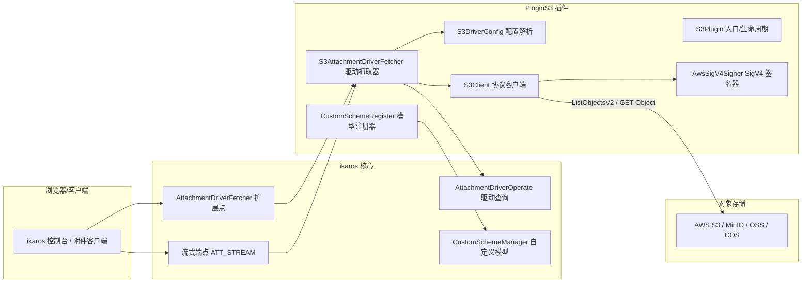
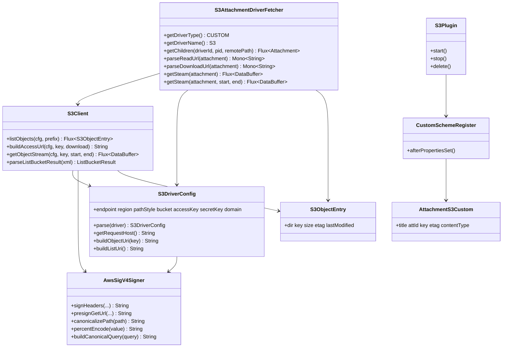
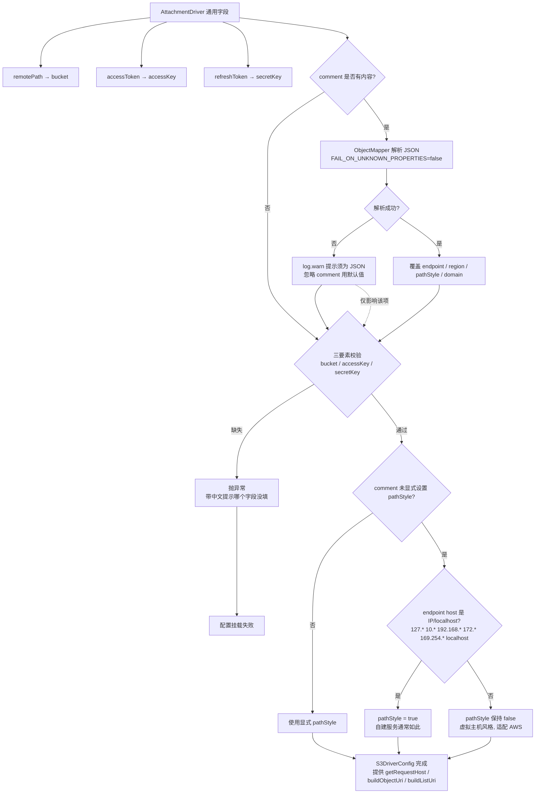
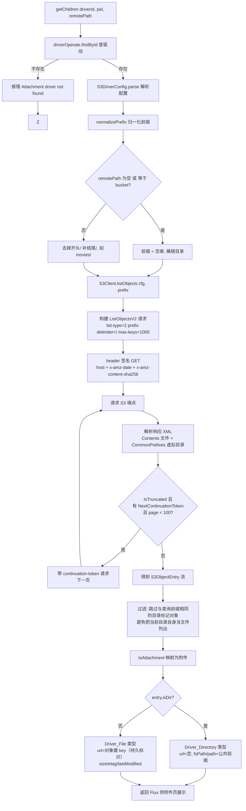
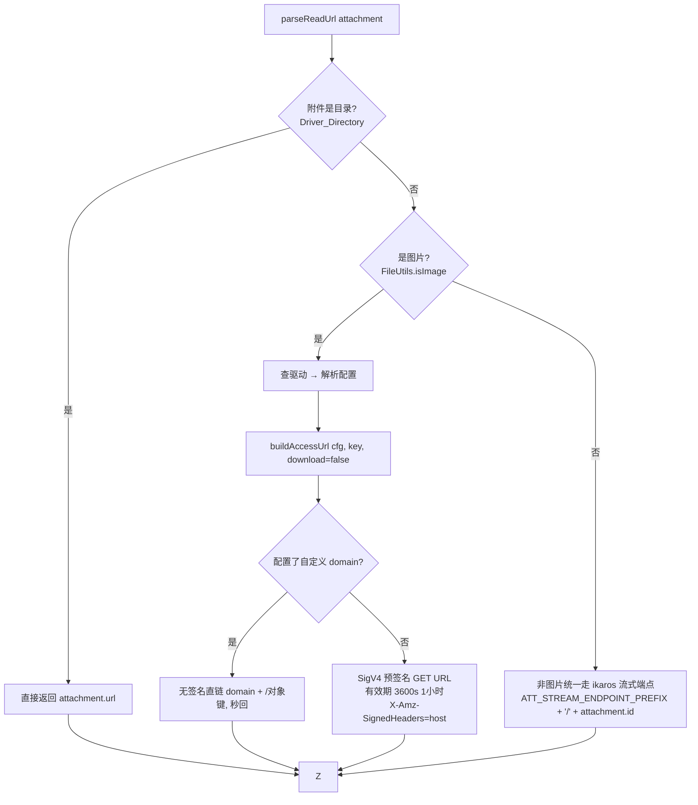
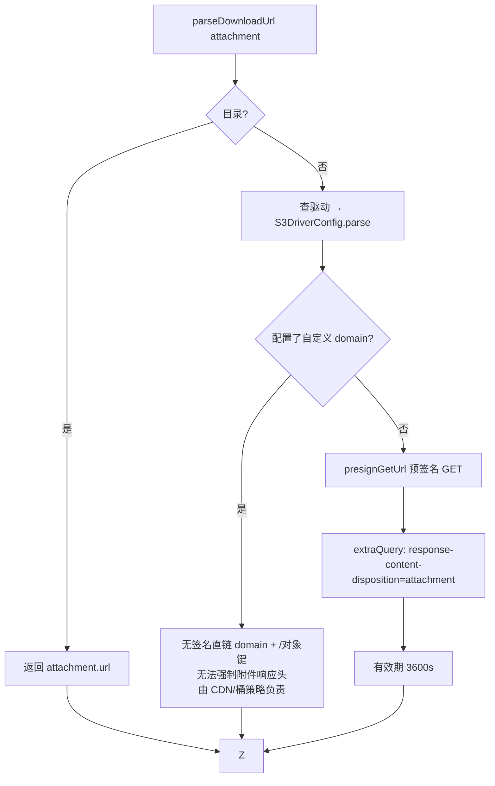
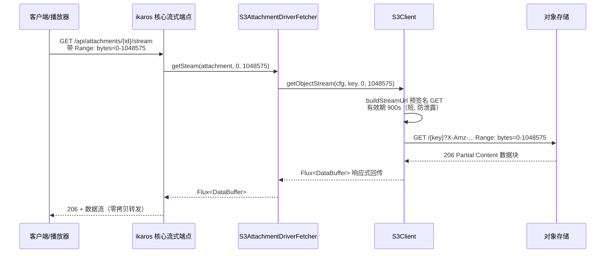
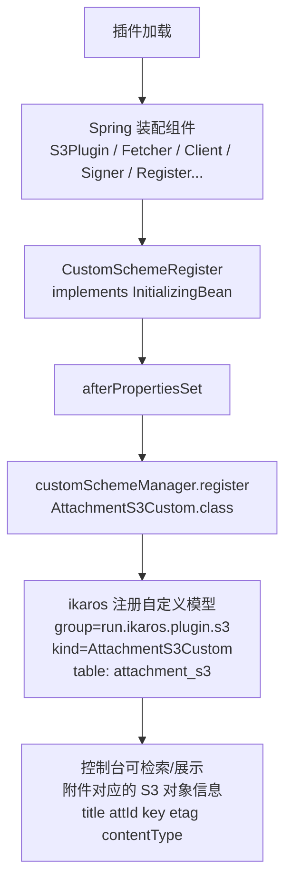
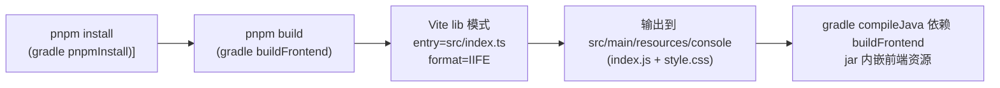
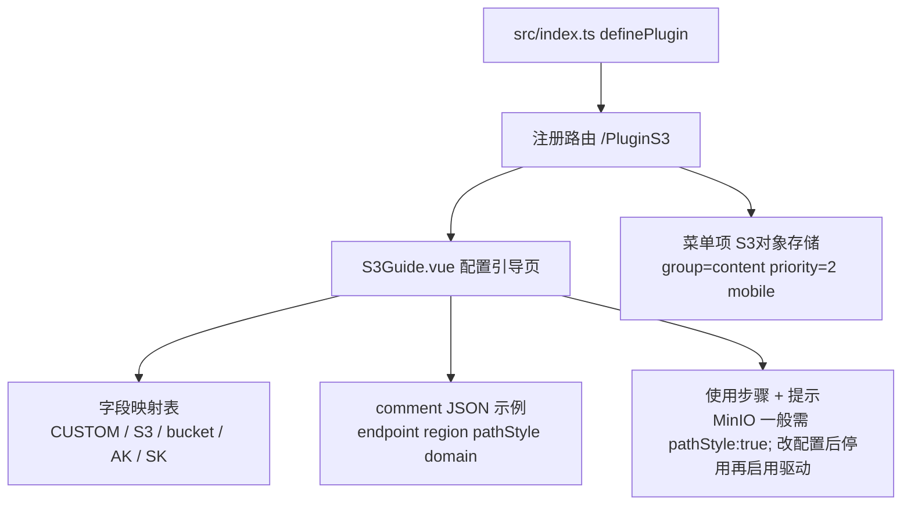

# plguin-s3（S3 对象存储插件）功能实现详解

> 本文档基于 `main` 分支最新代码（`fd199c4` / `85668fb`），逐功能点说明实现方式，
> 并配流程图。适用对象：插件开发者、ikaros 核心开发者、后续维护者。

---

## 1. 插件概述

S3 协议对象存储插件将**兼容 S3 协议**的对象存储（AWS S3、MinIO、阿里云 OSS、腾讯云 COS 等）
挂载为 ikaros 的 **CUSTOM 类型附件驱动**，提供：

- 目录浏览（ListObjectsV2 + 公共前缀识别虚拟目录）
- 附件读取（图片直链 / 非图片流式）
- 附件下载（强制附件响应头）
- 视频/音频 Range 分段流式播放
- 自定义访问域名（CDN / 公开读场景）

**核心设计原则：**

1. 不依赖任何 AWS SDK，AWS SigV4 签名由插件自行实现（`AwsSigV4Signer`）；
2. 密钥（AccessKey / SecretKey）只保存在服务端 ikaros 驱动配置中，**不下发前端**；
   前端拿到的始终是服务端按需生成的**临时预签名直链**；
3. 附件只保存对象键（`attachment.url = key`）作为持久标识，所有访问 URL 按需生成，过期自动失效。

### 1.1 总体架构



## 2. 模块结构与类职责



| 类 | 职责 |
|---|---|
| `S3Plugin` | 插件入口，继承 `BasePlugin`，处理 start/stop/delete 生命周期 |
| `S3AttachmentDriverFetcher` | 实现 ikaros `AttachmentDriverFetcher` 扩展点，驱动挂载与附件四类操作 |
| `S3DriverConfig` | 把 ikaros 附件驱动**通用字段**解析为 S3 专属配置，含 pathStyle 自动推断 |
| `S3Client` | 基于 Spring WebClient 的 S3 协议客户端：列表、直链、流式读取 |
| `AwsSigV4Signer` | 纯手写 AWS SigV4：header 签名 + query 预签名 + URL 编码规则 |
| `S3ObjectEntry` | 列表条目模型（对象文件 / 公共前缀虚拟目录） |
| `AttachmentS3Custom` | 自定义数据模型：附件 ↔ S3 对象信息，供控制台展示与检索 |
| `CustomSchemeRegister` | 插件启动时向 ikaros 注册自定义模型 |

插件声明见 `src/main/resources/plugin.yaml`：

- `name: PluginS3`（必须与 console `vite.config.ts#pluginEntryName` 一致且不含 `-`）
- `clazz: run.ikaros.plugin.s3.S3Plugin`，`requires: ">=0.11.4"`，版本 `1.0.0`

---

## 3. 功能点一：驱动挂载与配置解析

ikaros 附件驱动只有一组**通用字段**，S3 插件通过字段映射约定复用它：

| ikaros 驱动通用字段 | S3 含义 | 必填 |
|---|---|---|
| 类型（type） | `CUSTOM`（由 `getDriverType()` 声明） | — |
| 名称（name） | `S3`（由 `getDriverName()` 声明） | — |
| 挂载名（displayName） | 任意显示名 | — |
| 远程路径（remotePath） | **存储桶名称 bucket** | ✅ |
| 访问令牌（accessToken） | **Access Key ID** | ✅ |
| 刷新令牌（refreshToken） | **Secret Access Key** | ✅ |
| 备注（comment） | JSON 补充配置：endpoint / region / pathStyle / domain | 否 |

### 3.1 配置解析流程（`S3DriverConfig.parse`）



**要点：**

- `getRequestHost()`：pathStyle 时返回端点主机（`host[:port]`），否则返回虚拟主机风格
  `{bucket}.{host}`——签名 Host 头与请求 URL 均使用它，保证一致性；
- `buildObjectUri(key)`：pathStyle 时为 `/{bucket}/{key}`（分段编码），虚拟主机风格时为 `/{key}`；
- `buildListUri()`：pathStyle 时为 `/{bucket}`，否则 `/`。

---

## 4. 功能点二：目录浏览（列表）

`S3AttachmentDriverFetcher.getChildren()` 是附件的目录入口：



**要点：**

- **虚拟目录**：S3 没有真实目录，靠 `delimiter=/` 返回的 `CommonPrefixes`（如 `photos/`）呈现；
- **翻页**：`listObjects` 用 Reactor `expand()` 递归拉页，`ListObjectsV2` 单页上限 1000 条；
  安全上限 `MAX_LIST_PAGES=100` 防止服务端异常时无限翻页；
- **目录标记对象**：S3 常见以 `photos/`（0 字节）作为目录占位对象，若不过滤会把"目录本身"
  也列成一个文件，因此 `getChildren` 会跳过 `key == prefix` 的条目；
- XML 解析做了 **XXE 防护**（禁 DOCTYPE、禁用外部实体与 Schema）；
- ETag 去引号、LastModified 转 `LocalDateTime`、`Size` 解析异常兜底为 0。

---

## 5. 功能点三：附件读取

`parseReadUrl(attachment)` 按附件类型**分流**：



**要点：**

- **图片** → 预签名直链（1h），浏览器/控制台可 `` 直接展示；
- **非图片**（视频、音频、任意文件）→ 返回 ikaros 流式端点地址，由核心转发到
  `getSteam()` 处理，以支持 **Range 拖动**（见功能点五）；
- 两种场景密钥都不出服务端。

---

## 6. 功能点四：附件下载

`parseDownloadUrl(attachment)`：



URL 示例（虚拟主机风格 + 下载参数）：

```
https://my-bucket.s3.amazonaws.com/photo.jpg?
X-Amz-Algorithm=AWS4-HMAC-SHA256&X-Amz-Credential=AKIA...&
X-Amz-Date=...&X-Amz-Expires=3600&X-Amz-SignedHeaders=host&X-Amz-Signature=...
&response-content-disposition=attachment
```

> **注意（与 README 的差异）**：`domain` 直链的代码实现是 `domain + canonicalizePath(key)`
> （即 `{domain}/{对象键}`），README/引导页示例写的 `{domain}/{bucket}/{key}` 需由用户把
> bucket 段包含进 domain（或用虚拟主机风格域名）来对齐，代码本身不含 bucket 段。

---

## 7. 功能点五：流式播放（Range 分段）

两个 `getSteam` 重载：无范围版（整文件）与 `(attachment, start, end)` 范围版。
ikaros 流式端点按客户端 Range 请求头调用对应重载。



**要点：**

- 流式直链有效期仅 **900 秒**（`STREAM_PRE_SIGN_EXPIRE_SECONDS`），比读取直链更短；
- 支持 `bytes=start-end` 与 `bytes=start-`（无上限）两种 Range；
- 全程响应式（WebClient + Reactor），大文件不占内存；
- 配置 `domain` 时同样走无签名直链。

---

## 8. 功能点六：AWS SigV4 签名实现（核心）

不依赖 AWS SDK，`AwsSigV4Signer` 支持两种签名方式：

- **header 签名**（`signHeaders`）→ 列表等 REST 请求的 `Authorization` 头；
- **query 预签名**（`presignGetUrl`）→ 读取/下载/流式直链。

```mermaid
flowchart TD
    A[签名输入<br/>method canonicalUri query headers<br/>region accessKey secretKey now] --> B

    subgraph 准备
        B[amzDate yyyyMMdd'T'HHmmss'Z'<br/>dateScope yyyyMMdd]
        B --> C[scope = dateScope/region/s3/aws4_request]
        C --> D{签名方式}
    end

    D -- header 签名 --> H1[headers: host + x-amz-date + x-amz-content-sha256<br/>（x-amz-* 由签名器统一填充）]
    H1 --> H2[canonicalHeaders: 名小写字典序<br/>值 trim, 每行 名:值\n]
    H2 --> H3[signedHeaders 名列表用; 连接]

    D -- query 预签名 --> Q1[query 注入 X-Amz-Algorithm/Credential/Date/<br/>Expires/SignedHeaders=host]
    Q1 --> Q2[canonicalRequest 只需 host:值 单头<br/>payload 恒为 UNSIGNED-PAYLOAD]

    H3 --> CR[拼接 canonicalRequest<br/>method\ncanonicalUri\ncanonicalQuery\ncanonicalHeaders\nsignedHeaders\npayloadHash]
    Q2 --> CR

    CR --> ST[stringToSign = 算法\namzDate\nscope\nsha256Hex(canonicalRequest)]
    ST --> KEY[派生签名密钥<br/>kDate=HMAC(AWS4+secret, dateScope)<br/>kRegion=HMAC(kDate, region)<br/>kService=HMAC(kRegion, s3)<br/>kSigning=HMAC(kService, aws4_request)]
    KEY --> SIG[signature = HMAC-SHA256 十六进制]
    SIG --> OUT{输出}
    OUT -- header 签名 --> O1[Authorization: AWS4-HMAC-SHA256<br/>Credential=AK/scope, SignedHeaders=..., Signature=...]
    OUT -- query 预签名 --> O2[query 追加 X-Amz-Signature<br/>最终 URL = scheme://host + canonicalUri + ?canonicalQuery]
```

**编码规则（S3 规范，签名一致性的关键）：**

| 位置 | 规则 |
|---|---|
| canonical URI 路径 | 按 `/` 分段，**每段** RFC3986 百分号编码，`/` 保留不编码 |
| canonical 查询串 | 参数名+值**全部**百分号编码（含 `/` → `%2F`），按参数名字典序 |
| unreserved 字符 | `A-Z a-z 0-9 - _ . ~` 不编码，其余（含中文、空格）编码为大写 `%XX` |
| `X-Amz-Signature` | 十六进制，最终 URL 不编码 |
| 空/根路径 | 返回 `/` |
| payload | 无请求体统一用 `UNSIGNED-PAYLOAD` |

**已签名的请求头（AWS CLI 同款标准）**：`host`、`x-amz-date`、`x-amz-content-sha256`。
Host 由 WebClient 根据 URL 自动生成，签名与其一致，无需（也不应）手动覆盖。

---

## 9. 功能点七：自定义模型注册（AttachmentS3Custom）



`AttachmentS3Custom` 通过 `@Custom` 注解声明（`singular = "attachment_s3"`，
`plural = "attachment_s3s"`），`@Name` 标注 `title` 作为显示标题。该模型记录附件 ↔ S3
对象键/ETag/内容类型的映射，供控制台展示与检索。

---

## 10. 功能点八：前端配置引导页（console）

插件自带一个 console 引导页（`S3Guide.vue`），引导用户正确填写驱动字段。

### 10.1 构建集成



- `vite.config.ts#pluginEntryName = "PluginS3"` **必须等于** `plugin.yaml` 的 `name`；
- `build.gradle`：`compileJava` → `buildFrontend`（`pnpm build`）→ `pnpmInstall`，
  后端编译前自动构建前端，产物打进插件 jar 的 `resources/console`。

### 10.2 页面与路由



---

## 11. 关键实现细节与踩坑记录

1. **WebClient 二次编码陷阱**：对已编码 URL（含 `%2F` 的查询串）直接 `.uri(String)`
   会二次编码导致签名失效 → 必须 `URI.create(url)` 后传 `.uri(URI)`。
   （真 MinIO 集成测试抓到的 bug）
2. **`%2F` 编码**：canonical query 中 `/` 必须编码为 `%2F`，而 canonical URI 中 `/`
   是路径分隔符不编码——两者规则不同，写死容易错。
3. **依赖来源**：`springdoc` 传递提供 jackson + commons-lang3（pan115 不声明也能编译的
   原因）；测试编译缺 `api-1.1.0.jar` → `build.gradle` 需 `testCompileOnly files(libFile)`
   及 pf4j/reactor/webflux 的 testCompileOnly + testRuntimeOnly。
4. **XXE 防护**：`DocumentBuilderFactory` 禁用 DOCTYPE 与外部实体/Schema。
5. **pathStyle 自动推断**：IP / localhost 端点自动切 path-style（自建服务无法用
   虚拟主机风格），域名端点保持虚拟主机风格（AWS 默认）。
6. **签名用黄金值验证**：用 botocore 1.43.77（纯 Python wheel）+ 冻结时间交叉验证
   预签名结果，与官方实现完全一致（见 12 节）。
7. **console 依赖锁定**：vue-tsc 1.8.27 与 Node 24 / TS 5.9 不兼容，需升
   vue-tsc ^2.1.10、ts ^5.5.4、vite ^5.4.19。
8. **CI 文件**：gh OAuth token 无 workflow scope，`ci_build_jar.yml`、
   `ci_release_by_tag.yml` 仅保留本地 `.bak`，未纳入提交。

---

## 12. 测试覆盖

| 测试类 | 覆盖点 |
|---|---|
| `AwsSigV4SignerTest` | 预签名 URL 与 AWS 官方文档示例一致；与 botocore（SigV4QueryAuth，时间冻结）交叉验证签名逐字符一致 |
| `S3ClientTest` | ListObjectsV2 XML 解析（Contents / CommonPrefixes / IsTruncated / NextContinuationToken / ETag 去引号）；直链生成；配置解析 |
| `S3DriverConfigTest` | comment JSON 解析覆盖默认值；缺 comment 用默认；IP 端点自动 pathStyle；bucket 缺失报错；非法 comment 回退默认 |
| `S3AttachmentDriverFetcherTest` | 前缀归一化（根目录空串 / 补结尾 `/`）；目录与文件到附件的映射 |

运行：`./gradlew test`（4 个测试类全部通过）。

---

## 13. 相关文件索引

```
src/main/java/run/ikaros/plugin/s3/
├── S3Plugin.java                  # 插件入口（生命周期）
├── S3AttachmentDriverFetcher.java # 驱动抓取器（挂载/浏览/读取/下载/流式）
├── S3DriverConfig.java            # 配置解析（字段映射 + pathStyle 推断）
├── S3Client.java                  # S3 协议客户端（列表/直链/流式）
├── S3Const.java                   # 常量（端点/有效期/限额/UA）
├── AttachmentS3Custom.java        # 自定义数据模型
├── CustomSchemeRegister.java      # 自定义模型注册
├── model/S3ObjectEntry.java       # 列表条目模型
└── utils/AwsSigV4Signer.java      # AWS SigV4 签名器（header + 预签名）
console/
├── src/index.ts                   # 控制台插件入口（路由/菜单）
├── src/views/S3Guide.vue          # 配置引导页
└── vite.config.ts                 # 前端构建（输出到 resources/console）
src/main/resources/plugin.yaml     # 插件元信息
```